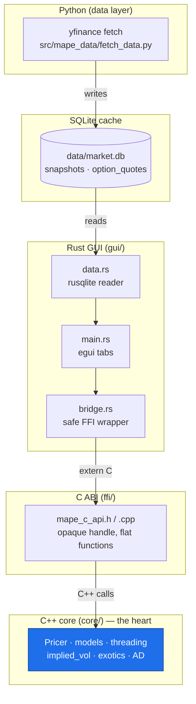
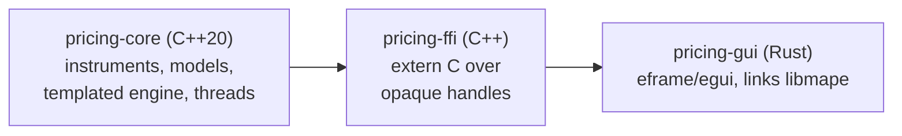
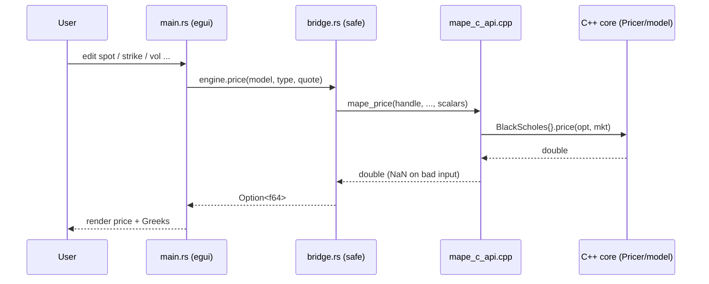
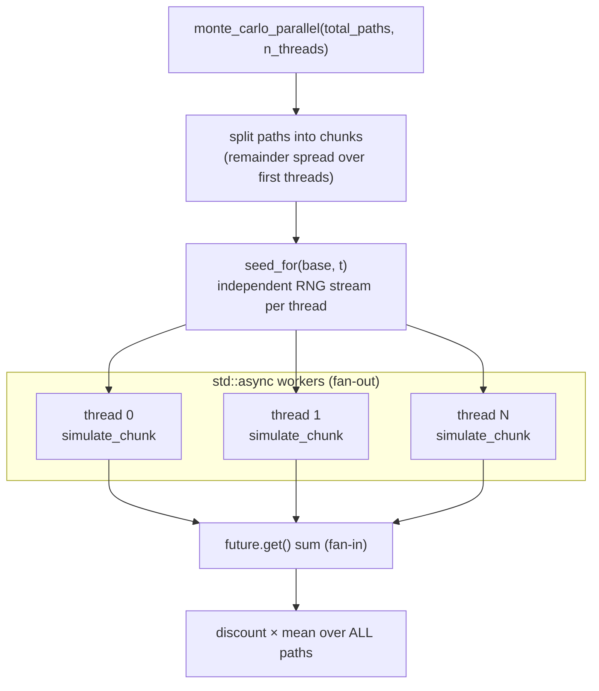
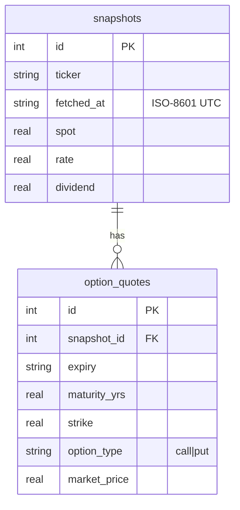
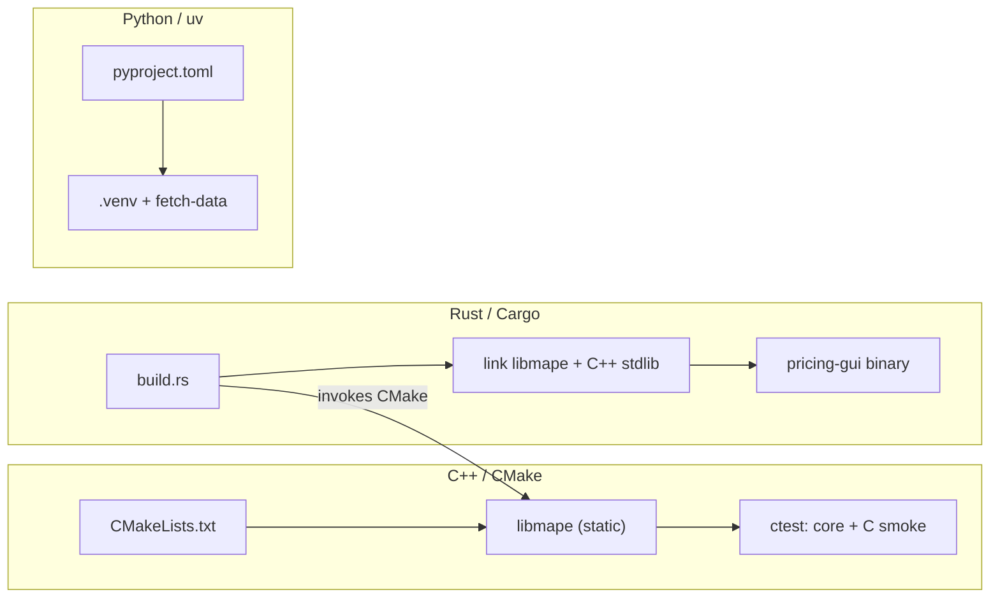

# Architecture

This document describes how the pieces of the multi-asset pricing engine fit
together. For the deep-dive on the C++20 language features (concepts, templates,
threading) see [cpp20-concepts.md](cpp20-concepts.md).

## The big picture

Three languages, three responsibilities, one strict rule: **the C++ core knows
nothing about its consumers.** It never includes a C header, never links Rust,
never opens a socket or a database. Everything flows *toward* the core.

The dependency arrows only point downward/inward. The Python side is a
completely separate process that communicates with the rest exclusively through
the SQLite file — there is no Python ↔ C++ binding.

## Component responsibilities

- **`core/`** — pure C++20, header-only. Domain types, pricing models, the
  templated `Pricer`, threading utilities, the implied-vol solver, exotics, and
  automatic-differentiation Greeks.
- **`ffi/`** — a thin `extern "C"` layer producing `libmape`. Translates between
  C scalars/enums and C++ types, and catches every exception so none unwinds
  across the language boundary.
- **`gui/`** — the Rust desktop app. `build.rs` compiles the C++ library via
  CMake and links it; `bridge.rs` wraps the raw C calls in a safe API; `data.rs`
  reads the SQLite cache; `main.rs` is the UI.

## Single-instrument pricing call

What happens when a user changes an input in the GUI's *Single* tab:

The same shape applies to Greeks, implied vol, exotics, and portfolio pricing —
only the C function and the core call differ.

## Parallel Monte Carlo (the threading showcase)

The *Reprice all* and exotic-pricing paths fan work across threads, then reduce.
See `core/include/mape/threading/parallel_mc.hpp`.

The critical correctness detail: each thread gets a **disjoint** random stream
via `seed_for` (a SplitMix64 mix of the base seed and thread index). Sharing a
generator across threads would both race and statistically bias the estimate.
This is verified clean under ThreadSanitizer.

## The data layer

`fetch_data.py` appends a time-stamped `snapshot` per ticker plus its option
chain. The Rust `data.rs` reads the latest snapshot (via the `latest_snapshots`
view) and feeds each quote's market price to `implied_vol` to build the
volatility smile. Strikes with no valid implied vol are skipped.

## Build flow

The three build systems are independent: CMake builds the core/FFI, Cargo's
`build.rs` reuses CMake to produce `libmape` and links it into the GUI, and uv
manages the Python fetcher. None of them reaches into the others' territory.
