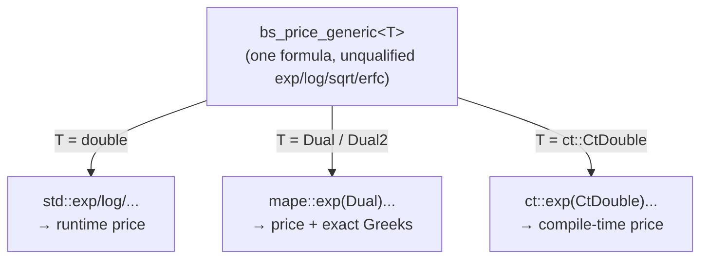
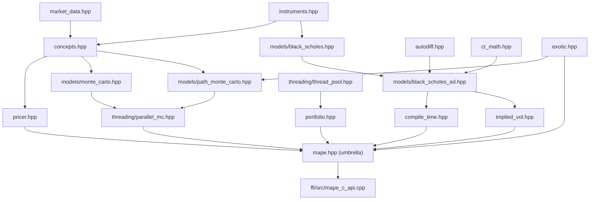
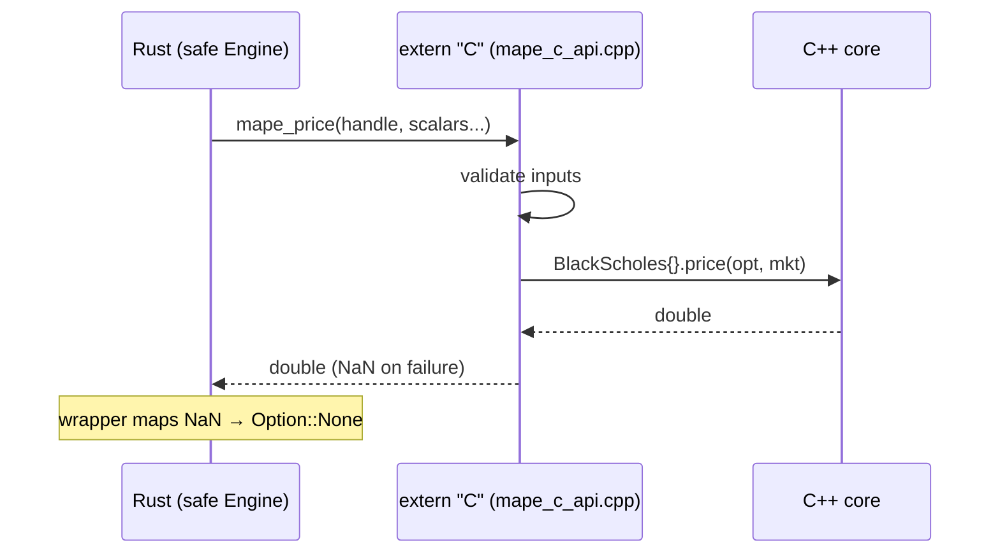

# C++ Design — Rationale and Internals

This document explains *why* the C++ core is built the way it is, how the
modules connect, and how the FFI boundary works. It's the "why" companion to
the [code map](cpp-codemap.md) (the "where") and the
[C++20 concepts deep-dive](cpp20-concepts.md) (the "what").

- [Guiding principles](#guiding-principles)
- [Why header-only](#why-header-only)
- [Why concepts instead of inheritance](#why-concepts-instead-of-inheritance)
- [The scalar-generic trick: one formula, three modes](#the-scalar-generic-trick-one-formula-three-modes)
- [Threading design](#threading-design)
- [How the modules connect](#how-the-modules-connect)
- [How the FFI works](#how-the-ffi-works)
- [Error-handling philosophy](#error-handling-philosophy)
- [Trade-offs and what was deliberately left out](#trade-offs-and-what-was-deliberately-left-out)

---

## Guiding principles

Three rules shaped every decision:

1. **The core knows nothing about its consumers.** No header in `core/` includes
   a C header, links Rust, opens a socket, or touches a database. Dependencies
   point inward only. This is what lets the same engine serve a Rust GUI, a C
   program, a test harness, or a future Python binding without change.
2. **Make the two required features (templates, threads) load-bearing, not
   decorative.** Templates *are* the engine's polymorphism; threads *are* how
   Monte Carlo and portfolios scale. Neither is bolted on for show.
3. **Prefer compile-time errors and "no result" over runtime surprises.**
   Concepts reject bad model types at the call site; `implied_vol` returns
   `std::optional` when no vol exists; the FFI returns `NaN`/status codes rather
   than letting anything throw across the boundary.

---

## Why header-only

The entire core lives in headers under `core/include/mape/`, with no `.cpp`
files. Reasons:

- **It's almost all templates.** `Pricer<Model>`, `bs_price_generic<T>`, the
  Monte Carlo cores, and the thread pool's `submit` are templates — they must be
  visible at the point of instantiation anyway, so a separate `.cpp` would buy
  nothing.
- **Trivial consumption.** A consumer adds `-Icore/include` and `#include
  "mape/mape.hpp"`. No library to build or link for the pure-C++ path; the
  test harness compiles with a single `g++` command.
- **The cost is paid once, at the FFI.** The only place that needs a compiled
  artifact is the `libmape` boundary, so that's the only `.cpp`
  (`ffi/src/mape_c_api.cpp`). Compile-time cost stays bounded because just one
  translation unit instantiates the templates for the exported entry points.

The discipline this requires: every header is self-contained (its own include
guard, includes exactly the standard headers it uses). A header that compiles
because some *other* header happened to pull in `<algorithm>` is a latent bug —
libc++ and libstdc++ differ on transitive includes, so we include directly.

---

## Why concepts instead of inheritance

The classic OOP design would be an abstract `PricingModel` base class with a
virtual `price()` and `BlackScholes : PricingModel`, etc. We deliberately use
**C++20 concepts + templates** instead. The contrast:

| | Virtual base class | Concept + template (chosen) |
|---|---|---|
| Dispatch | Runtime (vtable indirection) | Compile-time (inlined) |
| New model | Inherit + override | Free struct with a `price()` method |
| Misuse | Compiles, maybe crashes | Fails to compile at the call site |
| Overhead | Indirect call per price | None — fully inlined |

`Pricer<Model>` (in `pricer.hpp`) is constrained `template <PricingModel
Model>`. A model is anything with `double price(const Option&, const
MarketData&)` — no base class, no `override`, no `virtual`. The concept
(`concepts.hpp`) is the contract, checked by the compiler:

```cpp
template <typename T>
concept PricingModel = requires(const T m, const Option& opt, const MarketData& mkt) {
    { m.price(opt, mkt) } -> std::convertible_to<double>;
};
```

The payoff is performance (no virtual dispatch in the inner Monte Carlo loop,
which matters at millions of paths) *and* better diagnostics — try
`Pricer<int>` and you get "int does not satisfy PricingModel" at the
declaration, not a wall of template-internal errors.

The trade-off we accepted: you can't store a heterogeneous `vector<PricingModel*>`
the way you could with a base class. For a fixed, small set of models known at
compile time, that's no loss; the FFI's `price_with_model` simply `switch`es
over the model enum. (For the *instruments* — which genuinely are
heterogeneous — we use `std::variant` instead; see `instruments.hpp`.)

---

## The scalar-generic trick: one formula, three modes

The most elegant decision in the codebase. `bs_price_generic<T>` (in
`models/black_scholes_ad.hpp`) writes the Black-Scholes formula **once**,
templated on the number type `T`, calling unqualified `exp`/`log`/`sqrt`/`erfc`.
ADL (argument-dependent lookup) then resolves those calls differently per type:



- **`double`** → the `using std::exp;` declarations win → ordinary runtime price.
- **`Dual` / `Dual2`** (`autodiff.hpp`) → ADL finds `mape::exp(Dual)` etc., which
  propagate first/second derivatives by the chain rule → **exact Greeks** (delta,
  vega, rho from `Dual`; gamma from the second-order `Dual2`), no bumping.
- **`ct::CtDouble`** (`ct_math.hpp`) → ADL finds the `constexpr` overloads →
  **compile-time price**, foldable in a `static_assert`.

Why this matters: there is exactly **one** Black-Scholes implementation. The
runtime model, the AD Greeks, and the compile-time regression tests can never
drift apart, because they're literally the same code instantiated three ways.
Adding a fourth mode (say, interval arithmetic) would mean writing one new
scalar type, not re-deriving the formula.

This is also why the core writes its *own* `constexpr` transcendentals in
`ct_math.hpp`: the C++20 `<cmath>` functions aren't `constexpr` (that's C++23),
so the compile-time mode needs `sqrt_ct`/`exp_ct`/`log_ct` and an
Abramowitz-Stegun `constexpr` normal CDF. The `consteval` coefficient table
guarantees those constants are materialised at compile time.

---

## Threading design

Monte Carlo is *embarrassingly parallel* — every simulated path is independent —
which is why it's the threading showcase. Two distinct patterns:

**1. Fan-out / fan-in for Monte Carlo** (`threading/parallel_mc.hpp`). Split the
paths into chunks, launch each on `std::async(std::launch::async, …)`, then
reduce the partial sums via `future::get()`. The subtlety that's easy to get
wrong and worth calling out: each worker needs a **statistically independent**
random stream. Sharing one generator both races (data race) and biases the
estimate. So each thread derives a disjoint seed from a base seed and its index
via a SplitMix64 mix (`seed_for`). The single- and multi-threaded results agree
with the analytic price within Monte Carlo error, and the whole thing is clean
under ThreadSanitizer.

**2. A worker pool for portfolios** (`threading/thread_pool.hpp`). A fixed set of
`std::thread` workers drain a `std::mutex`-guarded queue, sleeping on a
`std::condition_variable` until there's work. Used by `price_portfolio`
(`portfolio.hpp`) to price a whole book concurrently — one task per instrument.
`submit` is generic (`template <typename F>`) and returns a
`std::future<invoke_result_t<F>>` via a `std::packaged_task`. The pool is RAII:
its destructor sets a stop flag, notifies all workers, and joins them, so no
thread leaks and no task is left half-run.

Why both patterns rather than one? `std::async` is the right tool for a
*one-shot* fan-out (a single Monte Carlo run). A persistent pool is right for
*repeated* dispatch (a portfolio repriced many times) where you don't want to
spawn/join threads on every call. The FFI engine owns one pool so portfolio
calls reuse workers across invocations.

---

## How the modules connect



The dependency graph is acyclic and flows toward the umbrella header, which the
FFI includes. Note the two interesting hubs:

- **`concepts.hpp`** is depended on by every model and the generic engine — it's
  the shared vocabulary.
- **`black_scholes_ad.hpp`** is the convergence point of the scalar-generic
  trick: AD (`autodiff.hpp`), compile-time math (`ct_math.hpp`), implied vol, and
  compile-time pricing all build on the one generic formula.

---

## How the FFI works

The FFI (`ffi/`) is the only place C++ meets the outside world. Its job is to
present a **flat, stable C ABI** that any language can call, while keeping all
C++ types on the C++ side. Four mechanisms make that safe:

### 1. Opaque handle

The engine is exposed as an incomplete type — callers hold a pointer, never the
layout:

```c
// in the header:
typedef struct MapeEngine MapeEngine;          // opaque, never defined in C
```
```cpp
// in the .cpp, the real definition:
struct MapeEngine {
    mape::ThreadPool pool{};   // C++ member the caller never sees
};
```

The C side can't see (and can't depend on) what's inside, so the C++ internals
can change freely without breaking the ABI. The handle also lets the engine hold
state — here, a reusable thread pool for portfolio pricing.

### 2. Only plain scalars and enums cross the boundary

Every exported function takes `double`, `size_t`, `int`, C enums, and pointers
to those. No `std::string`, no `std::vector`, no C++ objects. Enums are
translated at the edge (`to_type`, `to_exercise` in the anonymous namespace).
Arrays come in as pointer + length (`mape_price_portfolio`,
`mape_convergence`), and the caller owns the output buffer.

### 3. No exception may cross `extern "C"`

An exception unwinding from C++ into C (or Rust) is undefined behaviour. So
**every** entry point wraps its body in `try { … } catch (...) { … }` and
converts failure into a return value:

```cpp
double mape_price(...) {
    double out = std::nan("");
    mape_price_ex(..., &out);   // the _ex variant returns a status code
    return out;                 // NaN signals "no value"
}
```

Two flavors are offered: the simple functions return `NaN` on any failure; the
`_ex` variants return a `MapeStatus` code (`MAPE_OK`, `MAPE_ERR_NULL_HANDLE`,
`MAPE_ERR_BAD_INPUT`, …) and write the result through an out-pointer. Inputs are
validated (`valid_market`) before touching the core.

### 4. Explicit ownership

The rule is stated in the header and enforced by the consumer: whoever calls
`mape_create()` must call `mape_destroy()`. `mape_destroy(nullptr)` is safe
(`delete` on null is a no-op). The Rust wrapper encodes this in the type system —
its `Engine` struct calls `mape_destroy` in `Drop`, so it's impossible to leak
or double-free from safe Rust.

### The full call path



The C ABI is verified two ways: a pure-C smoke test (`ffi/tests/c_smoke_test.c`)
proves a non-C++ caller can link and use it, and a signature check confirms the
Rust `extern "C"` declarations match the header function-for-function.

---

## Error-handling philosophy

The core prefers honesty over fabrication:

- **`implied_vol`** returns `std::optional<double>` — `nullopt` when no real
  volatility reproduces the price (below intrinsic, past the no-arbitrage bound,
  or numerically degenerate deep ITM/OTM). It never invents a number.
- **Compile-time validation** (`ct::make_option`, a `consteval`) rejects invalid
  option *literals* at build time — a negative strike won't compile.
- **The FFI** maps all of this to `NaN` / `MapeStatus`, which the Rust layer
  turns back into `Option` / `Result`.

The throughline: an impossible or invalid computation should be *unrepresentable*
or *clearly signalled*, not silently wrong.

---

## Trade-offs and what was deliberately left out

- **Single flat rate, no term structure.** `MarketData` holds one `rate`. Real
  systems use a bootstrapped yield curve; that's a noted stretch goal, kept out
  to stay focused on the language-feature story.
- **Discrete barrier monitoring.** Barriers are checked at each path step, not
  continuously — a known approximation.
- **No calibration.** Volatility is an input (or inverted via `implied_vol`); we
  don't fit a vol surface to market quotes.
- **`std::async` doesn't guarantee a new thread.** The standard permits it to run
  deferred; in practice the major implementations use a thread for
  `launch::async`, which is sufficient here. A production engine would use an
  explicit pool throughout.

These are conscious scope decisions, not oversights — the project is a study in
C++20 design (templates, concepts, threads, constexpr, AD) with a clean FFI, not
a production pricing library.
