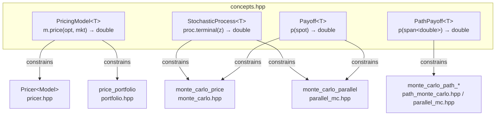
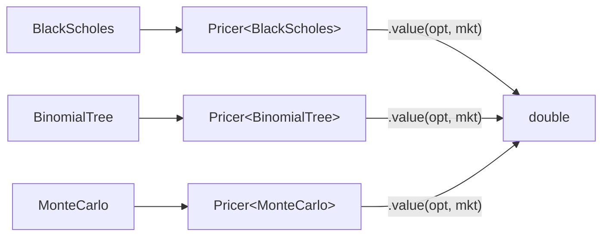
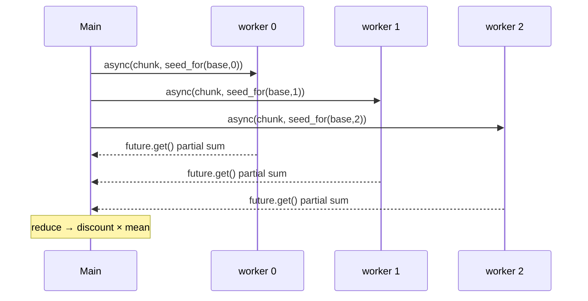
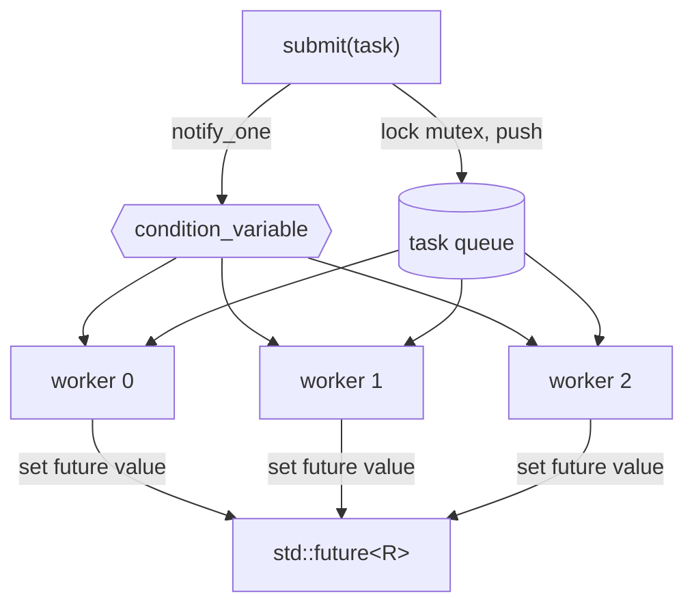

# C++20 Concepts, Templates, and Threading — a deep dive

This is an in-depth walkthrough of the three C++20 language features the project
leans on, **where** they live in the code, and **what** they actually do. Every
claim points at a real file so you can read along.

- [Part 1 — Concepts](#part-1--concepts-the-concept-keyword)
- [Part 2 — Templates](#part-2--templates)
- [Part 3 — Threading](#part-3--threading)

---

## Part 1 — Concepts (the `concept` keyword)

### What a concept *is*

A **concept** is a named, compile-time predicate on types. Before C++20, a
template accepted *any* type and failed deep inside instantiation with a wall of
errors if the type didn't have the right members. A concept lets you state the
requirements up front, so a non-conforming type is rejected at the call site
with a clear message — and the requirement doubles as documentation.

All four concepts in this project live in one file:
[`core/include/mape/concepts.hpp`](../core/include/mape/concepts.hpp).



### The `requires` expression

Each concept is written with a `requires` clause that lists expressions the type
must support, and what they must return. Verbatim from `concepts.hpp`:

```cpp
// A PricingModel can value an Option against a MarketData snapshot and return
// something convertible to a price.
template <typename T>
concept PricingModel = requires(const T m, const Option& opt, const MarketData& mkt) {
    { m.price(opt, mkt) } -> std::convertible_to<double>;
};
```

Read it as: "`T` is a `PricingModel` if, given a `const T`, an `Option`, and a
`MarketData`, the expression `m.price(opt, mkt)` is valid **and** its result is
convertible to `double`." The `{ expr } -> Constraint` syntax is a *compound
requirement*: it checks both that the expression compiles and that its type
satisfies the trailing constraint (here the standard-library concept
`std::convertible_to<double>`).

### The four concepts and what each requires

| Concept | Requirement | Who satisfies it | Who consumes it |
|---------|-------------|------------------|-----------------|
| `PricingModel` | `m.price(opt, mkt)` → `double` | `BlackScholes`, `BinomialTree`, `MonteCarlo` | `Pricer<Model>`, `price_portfolio` |
| `Payoff` | `p(spot)` → `double` | `CallPayoff`, `PutPayoff`, `VanillaPayoff` | the Monte Carlo cores |
| `StochasticProcess` | `proc.terminal(z)` → `double` | `GbmProcess` | Monte Carlo cores |
| `PathPayoff` | `p(span<const double>)` → `double` | `AsianPayoff`, `BarrierPayoff`, `LookbackPayoff` | path Monte Carlo |

`Payoff` and `StochasticProcess` verbatim:

```cpp
template <typename T>
concept Payoff = requires(const T p, double spot) {
    { p(spot) } -> std::convertible_to<double>;
};

template <typename T>
concept StochasticProcess = requires(const T proc, double normal_draw) {
    { proc.terminal(normal_draw) } -> std::convertible_to<double>;
};
```

`PathPayoff` is the one that makes exotic, path-dependent options drop in
cheaply — it takes a whole price path as a `std::span<const double>` (also a
C++20 feature):

```cpp
template <typename T>
concept PathPayoff = requires(const T p, std::span<const double> path) {
    { p(path) } -> std::convertible_to<double>;
};
```

### What this buys us

- **Errors at the boundary, not the bowels.** Try to build `Pricer<int>` and you
  get "`int` does not satisfy `PricingModel`" at the declaration, not a cascade
  of template-internal errors.
- **Self-documenting contracts.** A new model author reads `PricingModel` and
  knows exactly the one method to implement — no base class to inherit.
- **No runtime cost.** Concepts are purely compile-time; the generated code is
  identical to an unconstrained template.

---

## Part 2 — Templates

Templates are how the engine prices *any* (model, payoff) pair without
inheritance or virtual dispatch. There are four distinct uses.

### 2.1 The generic engine — `Pricer<Model>`

[`core/include/mape/pricer.hpp`](../core/include/mape/pricer.hpp):

```cpp
template <PricingModel Model>          // constrained template parameter
class Pricer {
public:
    explicit Pricer(Model model) : model_(std::move(model)) {}
    double value(const Option& inst, const MarketData& mkt) const {
        return model_.price(inst, mkt);
    }
private:
    Model model_;
};
template <typename Model> Pricer(Model) -> Pricer<Model>;   // deduction guide
```

`Pricer<BlackScholes>`, `Pricer<BinomialTree>`, and `Pricer<MonteCarlo>` are
three *separate, fully-inlined* types. There is no shared base class and no
`virtual` — the `model_.price(...)` call is resolved and inlined at compile
time. `template <PricingModel Model>` is the constrained form: `Model` must
satisfy the `PricingModel` concept or the program won't compile.



### 2.2 The templated Monte Carlo core

[`core/include/mape/models/monte_carlo.hpp`](../core/include/mape/models/monte_carlo.hpp)
is parameterised on *both* the stochastic process and the payoff:

```cpp
template <StochasticProcess Process, Payoff Pay>
double monte_carlo_price(const Process& process, const Pay& payoff,
                         std::size_t paths, double discount,
                         std::uint64_t seed = 12345ULL);
```

Adding a new payoff is just writing a small callable that satisfies `Payoff` (or
`PathPayoff`) — no change to the engine. That is the design the plan calls "a
new payoff is just a small callable."

### 2.3 Scalar-generic Black–Scholes for automatic differentiation

[`core/include/mape/models/black_scholes_ad.hpp`](../core/include/mape/models/black_scholes_ad.hpp)
writes the Black–Scholes formula **once**, templated on the number type:

```cpp
template <typename T>
T bs_price_generic(OptionType type, T S, T K, T r, T q, T sigma, T T_exp);
```

Instantiate with `T = double` and you get the price. Instantiate with `T = Dual`
(a dual number carrying a value *and* a derivative) and the same code computes
the price **and** an exact Greek by the chain rule — no bumping, no finite
differences. This is forward-mode automatic differentiation expressed purely
through templates.

### 2.4 The thread pool's generic `submit`

[`core/include/mape/threading/thread_pool.hpp`](../core/include/mape/threading/thread_pool.hpp)
accepts any callable and deduces its return type:

```cpp
template <typename F>
auto submit(F&& f) -> std::future<std::invoke_result_t<F>>;
```

`std::invoke_result_t<F>` (a C++ type trait) figures out what `f()` returns so
the pool can hand back the right `std::future<R>`.

---

## Part 3 — Threading

Monte Carlo is *embarrassingly parallel* — each simulated path is independent —
which makes it the natural showcase. Two files carry the concurrency.

### 3.1 Parallel Monte Carlo — fan-out / fan-in

[`core/include/mape/threading/parallel_mc.hpp`](../core/include/mape/threading/parallel_mc.hpp).
The structure is: split the paths into chunks, run each chunk on its own thread
via `std::async`, then reduce the partial sums via `std::future::get()`.

```cpp
template <StochasticProcess Process, Payoff Pay>
double monte_carlo_parallel(const Process& process, const Pay& payoff,
                            std::size_t total_paths, double discount,
                            unsigned n_threads = 0,
                            std::uint64_t base_seed = 12345ULL) {
    if (n_threads == 0)
        n_threads = std::max(1u, std::thread::hardware_concurrency());
    // ... split total_paths into chunks (remainder spread over first threads) ...
    std::vector<std::future<double>> futures;
    for (unsigned t = 0; t < n_threads; ++t) {
        const std::uint64_t seed = seed_for(base_seed, t);   // disjoint stream
        futures.push_back(std::async(std::launch::async,
            [&process, &payoff, this_chunk, seed] {
                std::mt19937_64 rng(seed);                   // per-thread RNG
                return simulate_chunk(process, payoff, this_chunk, rng);
            }));
    }
    double sum = 0.0;
    for (auto& f : futures) sum += f.get();                  // reduce
    return discount * (sum / static_cast<double>(total_paths));
}
```

Standard-library threading primitives used here:

- **`std::thread::hardware_concurrency()`** — default the worker count to the
  number of cores.
- **`std::async(std::launch::async, ...)`** — fan-out: each call launches work
  on a new thread and returns a `std::future`.
- **`std::future::get()`** — fan-in: blocks until a worker finishes and returns
  its partial sum.

#### The independent-RNG subtlety

The easy bug here is sharing one random generator across threads — it both data-
races and statistically corrupts the estimate. Instead each thread derives a
**disjoint** stream from a base seed and its index, using a SplitMix64 mix:

```cpp
inline std::uint64_t seed_for(std::uint64_t base, unsigned thread_index) {
    std::uint64_t z = base + 0x9E3779B97F4A7C15ULL * (thread_index + 1);
    z = (z ^ (z >> 30)) * 0xBF58476D1CE4E5B9ULL;
    z = (z ^ (z >> 27)) * 0x94D049BB133111EBULL;
    return z ^ (z >> 31);
}
```

The single-threaded and multi-threaded results agree with the Black–Scholes
analytic price within Monte Carlo error, and the whole thing is verified clean
under ThreadSanitizer (`-fsanitize=thread`).



### 3.2 The thread pool — portfolio pricing

[`core/include/mape/threading/thread_pool.hpp`](../core/include/mape/threading/thread_pool.hpp)
is a fixed set of worker threads draining a shared, mutex-guarded task queue.
It prices a whole book of instruments concurrently (one task per instrument).
Primitives used:

- **`std::thread`** — the persistent worker threads (`std::vector<std::thread> workers_`).
- **`std::mutex` + `std::lock_guard` / `std::unique_lock`** — guard the task
  queue against concurrent push/pop.
- **`std::condition_variable`** — workers sleep until there is work or a stop
  signal, instead of busy-waiting.
- **`std::packaged_task` + `std::future`** — wrap each submitted callable so the
  caller gets a future for its result.

```cpp
template <typename F>
auto submit(F&& f) -> std::future<std::invoke_result_t<F>> {
    using R = std::invoke_result_t<F>;
    auto task = std::make_shared<std::packaged_task<R()>>(std::forward<F>(f));
    std::future<R> fut = task->get_future();
    {
        std::lock_guard<std::mutex> lock(mutex_);
        tasks_.emplace([task] { (*task)(); });
    }
    cv_.notify_one();
    return fut;
}
```

The pool is RAII: its destructor sets a stop flag, notifies all workers, and
joins them, so no thread is left running and no task is half-finished.



### Where threading is invoked

- **Exotics** (`mape_price_exotic`) and the GUI smile/portfolio paths call
  `monte_carlo_parallel` / `monte_carlo_path_parallel`.
- **Portfolio pricing** (`price_portfolio` in
  [`core/include/mape/portfolio.hpp`](../core/include/mape/portfolio.hpp)) uses
  the `ThreadPool`.
- The opaque FFI engine owns one `ThreadPool` so portfolio calls reuse workers
  across invocations.

---

## Summary: feature → location

| Feature | File(s) |
|---------|---------|
| Concept definitions | `core/include/mape/concepts.hpp` |
| Generic engine | `core/include/mape/pricer.hpp` |
| Templated MC | `core/include/mape/models/monte_carlo.hpp`, `models/path_monte_carlo.hpp` |
| Scalar-generic BS (AD) | `core/include/mape/models/black_scholes_ad.hpp`, `autodiff.hpp` |
| Parallel MC (`std::async`/`future`) | `core/include/mape/threading/parallel_mc.hpp` |
| Thread pool (`thread`/`mutex`/`cv`) | `core/include/mape/threading/thread_pool.hpp` |
| Portfolio pricing via pool | `core/include/mape/portfolio.hpp` |
